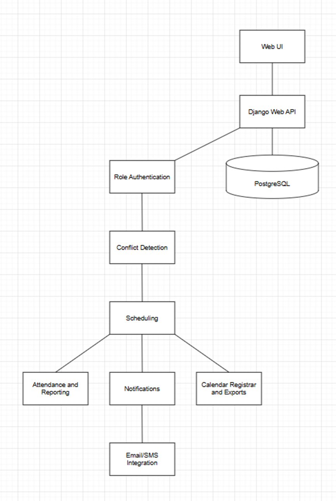

Zane Hill – CIDM 6325
Module 1 – Project Pitch Part A

Project Pitch - Student Athlete Management System (SAMS)

Problem
College teams juggle practices, lifts, travel, games, study halls, rehab, compliance sessions, and academics—often across multiple facilities and time zones. Coaches and athletes currently stitch together announcements, spreadsheets, texts, and calendar invites that drift out of sync. The result: missed events, double-bookings (e.g., training vs. class), late eligibility paperwork, and uneven communication for injured or traveling athletes.

SAMS provides a single source of truth for team schedules and athlete availability, with role-based views (Coach, Athlete, Staff), conflict detection against course timetables, attendance logging, and push/email notifications. Phase one targets reliability and clarity (accurate calendar + conflicts + communication) before expanding to performance analytics or recruiting.

Stake Holders
- Athletes – need a reliable personal view of all team commitments, conflicts with classes/work, and last-minute changes.
- Coaches – need to publish schedules, see conflicts at a glance, record attendance, and message athletes by group (position, travel roster).
- Athletic Trainers/Staff – need to mark limited/rehab statuses and see who is cleared to participate.
- Compliance/Academics – need auditable logs (e.g., countable athletically related activities) and term-time guardrails.
- Registrars/IT – may integrate course schedules, room resources, and single sign-on.
- Parents/Supporters (optional) – read-only calendar links for travel and game info.

Scope
In-scope for the Minimal Viable Artifact (2 weeks):
- Team Calendar & Events: practices, lifts, meetings, travel blocks, games; recurring rules; location + notes.
- Availability & Conflicts: athletes upload/confirm class schedules; system flags collisions (event ↔ class).
- Notifications: email and in-app alerts on create/update/cancel; optional iCalendar (.ics) subscribe.
- Attendance: coach/staff marks present/late/absent; per-event export.
- Role-based views: Coach (create/manage), Athlete (view/acknowledge), Staff (attendance/notes).
- Admin: seed seasons/teams; manage rosters.
Out-of-scope (defer):
- Recruiting CRM, performance/fitness integrations, GPS devices, grade ingestion, deep mobile app, payments.

Success Metrics
- Schedule reliability: ≥95% of events published ≥24h before start; ≤2% last-minute unacknowledged changes.
- Conflict reduction: ≥50% drop in event↔class conflicts after week 2 (tracked per athlete).
- Engagement: ≥80% athlete 7-day active rate; ≥90% of events with recorded attendance.
- Communication clarity: ≥75% of athletes enable calendar sync; notification open rate ≥60%.
Minimal Viable Artifact (shippable in 2 weeks)
1. Core Scheduling: CRUD for events (single/recurring), team calendar, ICS feed per user.
2. Availability + Conflict Detector: store per-athlete class blocks; highlight conflicts on event create and in athlete view.
3. Notifications + Attendance: email/in-app notifications for changes; event-level attendance logging and CSV export.
Iterative Method
Two short cycles:
1) Calendar + Attendance + Notifications (get the core loop working and dependable).
2) Availability + Conflicts + CSV Import for Classes (raise clarity; reduce collisions).

Each ends with a review gate against the success metrics; new requests (mobile app, React UI) are deferred unless a metric is blocked by the current design.
Evidence Base
U.S. Department of Education. Family Educational Rights and Privacy Act (FERPA). U.S. Department of Education, https://www2.ed.gov/policy/gen/guid/fpco/ferpa/index.html. Accessed 10 Sept. 2025.
Defines protections for student educational records, including schedules and attendance.
National Collegiate Athletic Association. Division I Manual: Countable Athletically Related Activities (CARA) & Time Management Plans. NCAA, 2023, https://www.ncaa.org/.
Outlines NCAA limits on athletic activity hours and time-management rules.
Internet Engineering Task Force. RFC 5545: Internet Calendaring and Scheduling Core Object Specification (iCalendar). IETF, 2009, https://www.rfc-editor.org/.
Standard for calendar interoperability across platforms.
World Wide Web Consortium. Web Content Accessibility Guidelines (WCAG) 2.1. W3C, 2018, https://www.w3.org/TR/WCAG21/.
Accessibility standards for digital scheduling tools.
NCAA Sport Science Institute. Mental Health Best Practices: Understanding and Supporting Student-Athlete Well-being. NCAA, 2022, https://www.ncaa.org/sport-science-institute.
Recommendations for balancing athletics, academics, and wellness.
Educause. Student Success Technologies: Scheduling and Engagement Platforms. Educause, 2024, https://www.educause.edu/.
Report on higher education scheduling and engagement systems.
Carnegie Commission on Higher Education. The Student-Athlete Experience: Balancing Education, Sport, and Well-Being. Carnegie Corporation of New York, 2021, https://carnegie.org/.
Research on challenges of time management for student-athletes.
National Athletic Trainers’ Association. Best Practices for Managing Athlete Workloads. NATA, 2022, https://www.nata.org/.
Guidelines for tracking workloads and recovery in athlete scheduling.

Risk	Impact	Likelihood	Mitigation
Privacy & compliance (FERPA): class schedules and attendance are educational records	High	Medium	Role-based access; audit logs; HTTPS; consent; retention policy; exclude health data in Phase 1
Scheduling conflicts remain high due to incomplete/late data (e.g., missing class blocks)	Medium	High	CSV imports for classes; “unknown time” flags; publish-by deadlines; conflict banner on athlete dashboard until resolved
Scope creep vs 2-week MVA (requests for mobile app, React UI, recruiting, performance analytics)	Medium	High	Review gates tied to metrics; freeze core flows; defer mobile/React features; maintain public backlog

 
